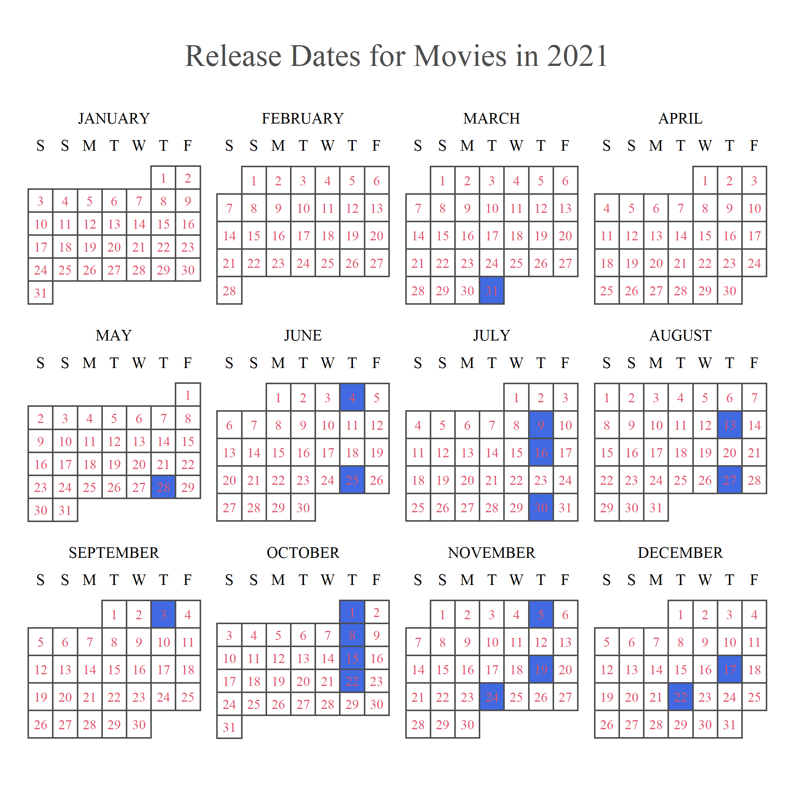

```{r setup, include=FALSE}
library(rvest)
library(tidyverse)
library(janitor)
library(readr)
library(dplyr)
library(gt)
library(scales)
library(ggthemes)
library(extrafont)
library(knitr)
loadfonts(device = "win")
knitr::opts_chunk$set(echo = FALSE)
```

```{r clean up movies url, echo = FALSE}
movies_url1 <- "https://www.boxofficemojo.com/year/2021/?grossesOption=totalGrosses&sort=rank&sortDir=asc&ref_=bo_yld__resort#table" #has list of movies from year of 2021
movies_2021 <- read_html(movies_url1) |> 
  html_element("body#body") |>
  html_table() |> 
  clean_names() |> 
  select(-c(genre, budget, running_time)) |>
  mutate(across(.cols = everything(), na_if, "-")) |> 
  mutate(gross = parse_number(gross),
         max_th = parse_number(max_th),
         opening = parse_number(opening),
         percent_of_total = parse_number(percent_of_total), # Needs to be a percentage.
         open_th = parse_number(open_th),
         estimated = parse_logical(estimated))
```

```{r clean up genre url, echo = FALSE}
genre_url1 <- "https://www.the-numbers.com/market/2021/genres"
genre_2021 <- read_html(genre_url1) |> 
  html_table()

genre_2021_clean <- genre_2021[[2]] |> 
  clean_names() |> 
  mutate(x2021_gross = parse_number(x2021_gross),
         tickets = parse_number(tickets),
         share = parse_number(share)) # This is in percentage
```
Section 1
```{r top ten movies of 2021 table, echo = FALSE}
movies_2021 |> # TOP 10 MOVIES FOR 2021 TABLE
  select(rank, release, gross, open, distributor) |>
  slice(1:10) |> 
  gt() |> 
  tab_header(title = md("**Top 10 Movies of 2021**")) |> 
  cols_label(rank = "Rank",
             release = "Title",
             gross = "Gross Dollar Amount",
             open = "Release Date",
             distributor = "Distribution Company") |> 
  tab_source_note(md("Source: *IMDb.com and Box Office Mojo*"))
```

```{r openings for top 10 2021 films, echo = FALSE, fig.width= 10, fig.height= 5}
movies_2021 |> #What movies had the best opening?
  select(release, percent_of_total) |> 
  slice(1:10) |> 
  arrange(desc(percent_of_total)) |> 
  ggplot(movies_2021, mapping = aes(x = release, y = percent_of_total, fill = release)) +
  geom_col() +
  scale_y_continuous(n.breaks = 6, 
                     limits = c(0,50), 
                     labels = unit_format(unit = "%")) +
  scale_x_discrete(expand = expansion(), labels = NULL) + 
  theme_economist() +
  labs(title = md("The Percentage of the Gross Dollar Amount\nthe Top 10 movies of 2021 made on\nOpening Weekend"),
       x = "Movie Title",
       y = "Opening Percent of Total",
       caption = "Source: IMDb.com and Box Office Mojo",
       fill = "Movie Title") +
  theme(text = element_text(family = "serif"),
        axis.title.x = element_text(size = 15),
        axis.title.y = element_text(size = 15),
        axis.text.y = element_text(size = 15),
        legend.text = element_text(size = 8),
        axis.line.x = element_blank(),
        axis.ticks.x = element_blank(),
        plot.title = element_text(hjust = .5))
```

Section 3

```{r table for count of distributors who made the top 10 films, echo = FALSE}
movies_2021 |> #TABLE FOR AMOUNT OF FILMS MADE BY EACH DISTRIBUTION COMPANY
  clean_names() |> 
  select(distributor, gross) |> 
  slice(1:10) |> 
  group_by(distributor) |> 
  summarize(count_per_distri = n()) |> 
  gt() |> 
  tab_header(title = md("**Number of Movies the Top 10 Movies\' Distribution Companies Made that ended up in the Top 10 of 2021**")) |> 
  cols_label(distributor = md("**Distribution Company**"),
             count_per_distri = md("**Count**")) |> 
  tab_source_note(md("Source: *IMDb.com and Box Office Mojo*"))
```

Section 4

```{r money made by top 10 distributors in 2021, echo = FALSE, fig.width= 10, fig.height= 5}
movies_2021 |> # THIS IS THE GRAPH OF MONEY MADE BY DISTRIBUTION COMPANY
  select(distributor, gross) |> 
  group_by(distributor) |> 
  summarize(total_gross_per_distri = sum(gross)) |> #Inaccurate because Foreign films are combined into an Na category
  arrange(desc(total_gross_per_distri)) |> 
  slice(1:10) |> 
  ggplot(movies_2021, 
         mapping = aes(x = distributor, 
                       y = total_gross_per_distri, 
                       fill = distributor)) +
  geom_col() +
  scale_y_continuous(n.breaks = 14, 
                     limits = c(0,1300000000), 
                     labels = unit_format(prefix = "$", 
                                          unit = "B", 
                                          scale = 1e-9)) +
  scale_x_discrete(expand = expansion(), labels = NULL) + 
  theme_economist() +
  labs(title = md("The Gross Dollar Amount the Top 10\nDistribution Companies made in films in 2021"),
       x = "Distribution Company",
       y = "Gross Dollar Amount",
       caption = "Source: IMDb.com and Box Office Mojo",
       fill = "Distribution Company") +
  theme(text = element_text(family = "serif"),
        axis.title.x = element_text(size = 15),
        axis.title.y = element_text(size = 15),
        axis.text.y = element_text(size = 15),
        legend.text = element_text(size = 8),
        axis.line.x = element_blank(),
        axis.ticks.x = element_blank(),
        plot.title = element_text(hjust = .5))
```

Section 5

```{r table of number of each genre released, echo = FALSE}
genre_2021_clean |> 
  select(rank, genre, movies) |> 
  gt() |> 
  tab_header(title = md("**Number of Movies in 2021 According to Genre**")) |> 
  cols_label(rank = "Rank",
             genre = "Genre",
             movies = "Count") |> 
  tab_source_note(md("Source: *Nash Information Services*"))
```

Section 6

```{r money per genre in 2021, echo = FALSE, fig.width= 10, fig.height= 5}
genre_2021_clean |> #Gross Dollar Amount 
  select(genre, x2021_gross) |> 
  ggplot(genre_2021_clean, 
         mapping = aes(x = genre,
                       y = x2021_gross,
                       fill= genre)) +
  geom_col() +
  scale_y_continuous(n.breaks = 12, 
                     limits = c(0,2400000000), 
                     labels = unit_format(prefix = "$", 
                                          unit = "B", 
                                          scale = 1e-9))+
  scale_x_discrete(expand = expansion(), labels = NULL) +
  theme_economist() +
  labs(title = md("Gross Dollar Amount of each type of Genre in 2021"),
       x = "Genre",
       y = "Gross Dollar Amount",
       caption = "Source: Nash Information Services",
       fill = "Genre") +
  theme(text = element_text(family = "serif"),
        axis.title.x = element_text(size = 15),
        axis.title.y = element_text(size = 15),
        axis.text.y = element_text(size = 15),
        legend.text = element_text(size = 8),
        axis.line.x = element_blank(),
        axis.ticks.x = element_blank(),
        plot.title = element_text(hjust = .5))
```

Section 7

```{r}

```
Section 8